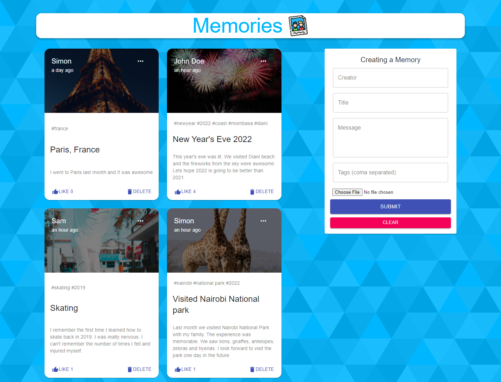

<h2>Memories Mern App</h2>
<h3>Technologies used</h3>
<ul>
<li>React</li>
<li>Node.js</li>
<li>Express</li>
<li>MongoDB</li>
</ul>



Setup:
- run ```npm i && npm start``` for both client and server side to start the app on your local machine.